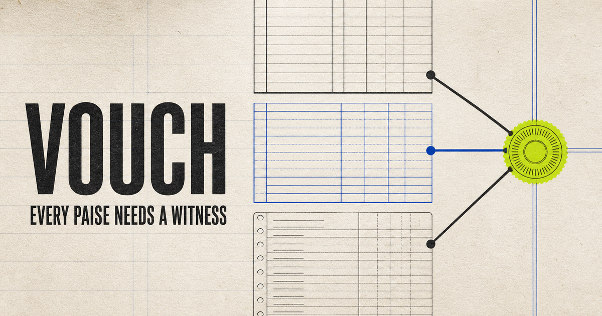

# Vouch

[](https://github.com/vinaytiwari754473-cmyk/vouch/actions/workflows/ci.yml)

**AI proposes. Deterministic code proves. A settlement closes to the paise—or Vouch refuses to guess.**

**Razorpay AI Buildathon · Track 4 — AI Finance Controller**

[Live product](https://vouch-settlement-proof.vvtt30691.chatgpt.site/) ·
[Architecture](docs/ARCHITECTURE.md) · [Reproduce locally](#quick-start) ·
[Evaluation methodology](eval/METRICS.md) · [Full results](eval/RESULTS.md)

Vouch is a three-source settlement verifier for Razorpay merchants. Razorpay Combined Recon says
what should have settled, the bank statement says what arrived, and the merchant ledger says what
the business recorded. Vouch automatically verifies a settlement only when the evidence is globally
unique, every required ledger check passes, and the equation closes at exactly `0` paise. Otherwise,
it opens an explicit exception instead of guessing.

### Committed synthetic development benchmark

| Metric | Observed result |
|---|---:|
| Source-row completeness | `1,083/1,083` |
| Settlement groups | `24` |
| Automatic coverage | `10/24` |
| Automatic verification precision | `10/10` |
| False automatic verifications | `0/10` |
| Unique-case recall | `10/11` |
| Ambiguity precision / recall | `3/3` / `3/3` |
| Accepted absolute residual | `0 paise` |
| Local median throughput | `3,012.61 rows/second` |

> These are results from the committed, deliberately fault-dense synthetic development benchmark
> `vouch-dev-2026-08-v1`. They are not held-out or production accuracy. The observed `0/10` does
> not mean zero future risk.

[](https://vouch-settlement-proof.vvtt30691.chatgpt.site/)

AI is used only to propose typed hypotheses from unresolved text evidence. It cannot compute money
or assign a verdict. Deterministic code verifies the cited source span, amount, currency and posting
window, rebuilds the global candidate graph, proves uniqueness, and reruns the zero-paise equation.

## Why this is different

- **Three witnesses:** merchant books, Razorpay recon and the bank must agree before the overall
  state can be `VERIFIED`.
- **No tolerance:** all money is safe-integer paise and an automatic match requires an exact
  zero-paise residual.
- **No greedy matching:** only edges required across all maximum matchings are accepted.
- **Bounded AI:** narration is untrusted data. AI can identify a literal source span and an
  allowlisted transformation; it cannot compute money or assign a status.
- **Honest exceptions:** short credit, excess credit, missing cash, ambiguity and ledger gaps remain
  distinct, actionable states.
- **Replayable:** the core artifact contains no wall-clock measurements. Identical logical inputs
  produce byte-identical canonical output.

## Quick start

Requirements: Node.js 22.13+ and pnpm 11.

```bash
pnpm install --frozen-lockfile
pnpm check
pnpm demo
pnpm dev
```

Open `http://localhost:3000`. The committed demo and replay evidence need no API key and no network.

Useful commands:

```bash
pnpm generate      # regenerate the deterministic development dataset
pnpm demo          # generate + reconcile + write the UI artifact
pnpm eval          # compare baseline, deterministic and verified-AI modes
pnpm benchmark     # 5 warmups + 30 measured sealed runs; separate provenance
pnpm capture:ai --provider codex-cli --model gpt-5.6-sol  # explicit live provenance capture
pnpm test          # adversarial and invariant tests
pnpm typecheck     # strict TypeScript across the workspace
pnpm build         # production web build
pnpm check         # typecheck + tests + production build
```

Live capture is never part of `pnpm demo` and never silently changes the committed replay. It
writes the exact supplied prompt/schema, public-input hash, request hash, adapter/provider/model,
response identifier, timing, token usage, hashed raw response and deterministic verifier verdicts to a
separate reviewable envelope. See [docs/AI-CAPTURE.md](docs/AI-CAPTURE.md).

## Repository map

```text
packages/core/        Pure reconciliation engine; no I/O, network, clock or truth imports
packages/generator/   Seeded synthetic merchant world and independent corruption layer
packages/eval/        Only package allowed to read truth; exact metric ratios and benchmarks
packages/cli/         File I/O and reproducible generate/run/report commands
apps/web/             Client-side evidence desk; renders a run artifact
data/dev/             Public development inputs and isolated truth manifest
eval/                 Pre-registered metrics and leakage controls
docs/                 Domain evidence, architecture, decisions, threat model and demo script
```

## The settlement equation

For each `settlement_id`, Vouch calculates:

```text
expected bank credit = Σ(recon.credit − recon.debit)
residual             = observed bank credit − expected bank credit
automatic acceptance requires residual = 0 paise
```

Razorpay payment `fee` already includes GST; `tax` is shown as a component and is never subtracted a
second time. Merchant records are compared to recon gross `amount`, while bank settlement uses the
authoritative recon `credit` and `debit` fields.

## Status model

Vouch does not compress unlike facts into one green badge:

```text
bank_status   EXACT | ASSISTED | DISCREPANCY | AMBIGUOUS | MISSING | INVALID
ledger_status VERIFIED | MISSING | MISMATCH | NOT_APPLICABLE | INVALID
review_status CLOSED | OPEN | MANUALLY_RESOLVED
```

Overall proof is possible only when the bank closes at zero and every required merchant record
passes. A manual resolution preserves the original system verdict and is excluded from automatic
accuracy metrics.

## Evaluation integrity

The development dataset is synthetic and deliberately fault-dense. Its aggregate score is a
challenge score, not an estimate of real merchant prevalence. Metrics retain exact numerators and
denominators. For the hybrid `0/10` false-automatic result, the two-sided Wilson 95% upper endpoint
is `27.75%`; this finite observation is not a universal safety claim.

Measured development results and limitations are reported in [eval/RESULTS.md](eval/RESULTS.md).
The current hybrid run observes `10/10` correct automatic verifications, `0/10` false automatic
verifications, `10/11` unique-case recall, and zero accepted residual paise.

No held-out result is claimed. A future held-out run would occur only after the solver, generator
distribution, prompt/schema, provider/model and evaluator are frozen together. Truth is
structurally inaccessible to `core`.

## Demo route

The five-minute judge flow is scripted in [docs/DEMO-SCRIPT.md](docs/DEMO-SCRIPT.md): golden
fee/tax proof, ₹0.50 short credit, globally ambiguous matching, verified AI narration span, prompt
injection rejection, then the pre-registered evaluation comparison.

The AI-assisted build process is documented in [docs/METHODOLOGY.md](docs/METHODOLOGY.md), and
first-person panel practice lives in [docs/QUESTIONS.md](docs/QUESTIONS.md).

## Scope

The MVP accepts settlement-credit bank exports, Combined Recon shaped JSON/CSV and a documented
batch-scoped merchant ledger. It does not move money, alter Razorpay data, infer accounting truth,
or auto-resolve without unique machine-verifiable evidence.

MIT licensed. Built for Razorpay Buildathon Track 4.
